# You know my stage name Quiz!

Here is the link to [You know my stage name Quiz](https://bolliebrain.github.io/you-know-my-stage-name/)

You know my stage name is an online Quiz. The user is asked to guess which answer is correct from a choice of three answers. There are 11 Questions to go through. Once the user selects an answer by clicking the relevant button, the game gives the feedback as to whether it was correct or not (green if correct and red if incorrect) and it also displays the correct answer. There is a progress status underneath the answers as well how they are doing in terms of questions answered correct. At the end of the quiz the user is brought to an end of quiz screen to see their score and feedback. From this point they can choose to start the game again. 

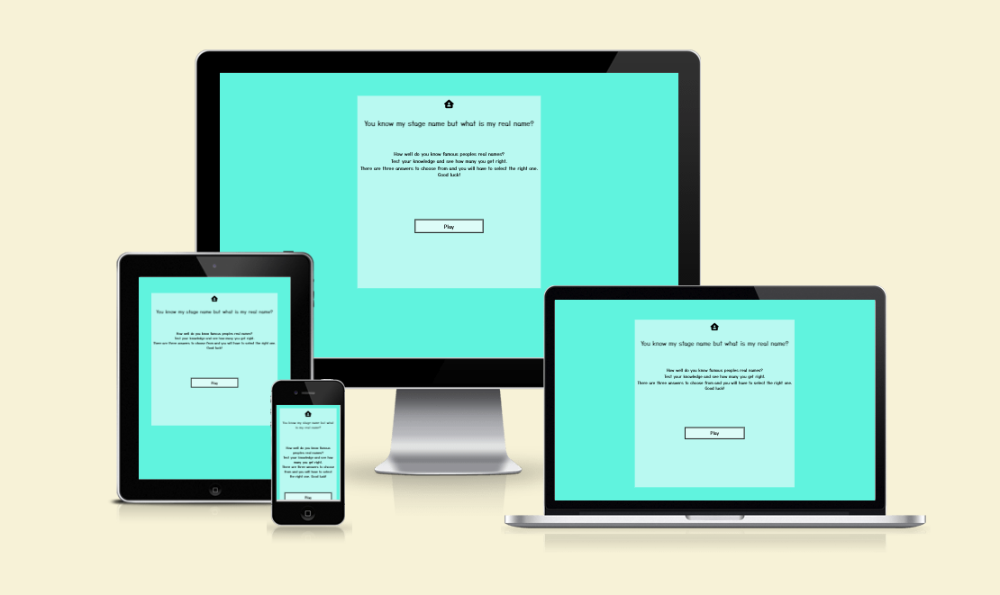

## **Index - Table of Contents**
- [User Experience (UX)](#user-experience-ux)
- [Features](#features)
- [Design](#design)
- [Technologies Used](#technologies-used)
- [Testing](#testing)
- [Deployment](#deployment)
- [Credits](#credits)

## **User Experience (UX)**

- ### User Stories - as a user I want to be able to :
- U01. Easily determine the purpose of the website.
- U02. Play a round of 11 questions.
- U03. Easily tell which question is being asked.
- U04. See a running total of correct answers.
- U05. Get feedback on whether or not the correct answer has been entered.
- U06. At the end of the quiz, get feedback on overall score for the quiz.
- U07. Navigate easily between game screens, including quitting and returning to the start.

## **Features**

### **Existing Features**

### 01. Welcome Page
- When the page is first loaded, the title, rules and purpose of the website is clearly introduced to the user.
- The user is then asked to move to the next page in order to play the quiz by pressing the "play" button.

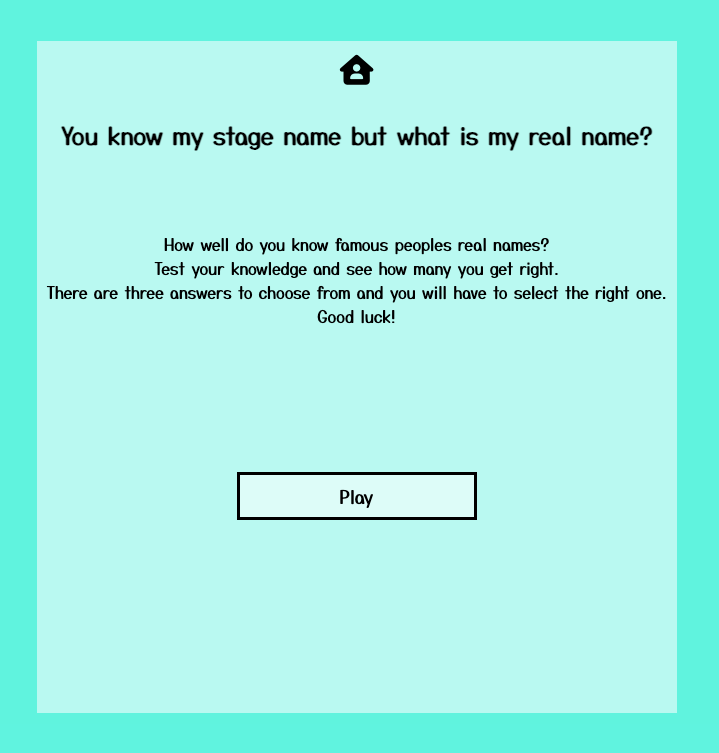

### 02. Navigation between screens
- The game is comprised of three pages :
1. Welcome page
2. Play game page
3. Final page

- The Navigation through the pages will happen by interacting with the game buttons to play the game.
- There is also a home button at the top of each page to help the user navigate back to the start.

### 03. Game Page
- Once the user has pressed play, they are taken to the game page and the quiz begins. There are a number of features on this screen, details of each feature is below.
1. The user is presented with a question/ stage name.
2. The user enters their answer by click one of the three possible answers
3. The game gives the user feedback on whether or not the correct answer was entered - the background of the box changes to red (incorrect) or green (correct). The number of correct answers is updated as appropriate and displayed on the bottom right of the screen. 
4. There progress of questions completed is also displayed on the bottom left of the screen to allow the user to see how much is left to do.
5. There is a 2 second time delay on the current answer check to allow the user to see whether they got the answer right or wrong (and if wrong, they are able to see what the correct answer was in green).

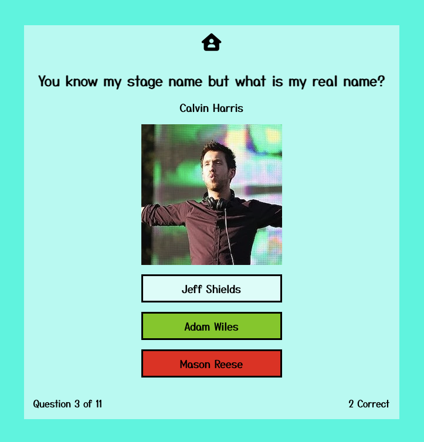

### 04. Final page
- Once the user has completed all 11 questions, they will automatically be taken to the Final Page where they will be presented with their final score and a reaction/message associated with how many correct answers they entered.
1. ".... this game isnt for everyone!"
2. " Wow, you really know your stuff!"
3. "Nice work!"

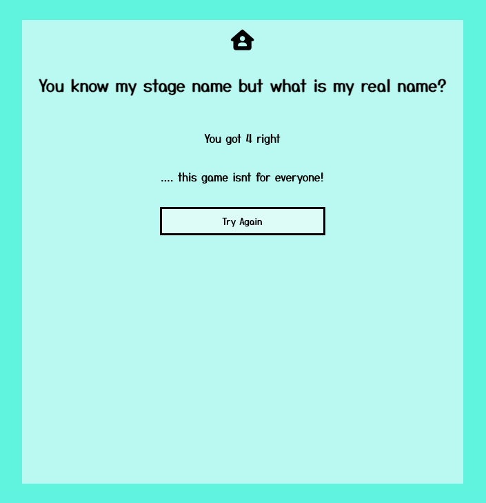
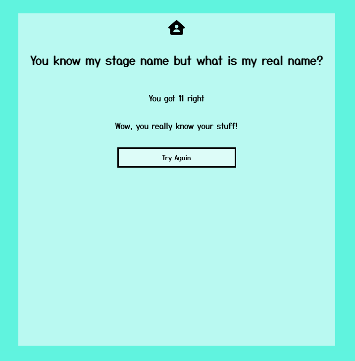
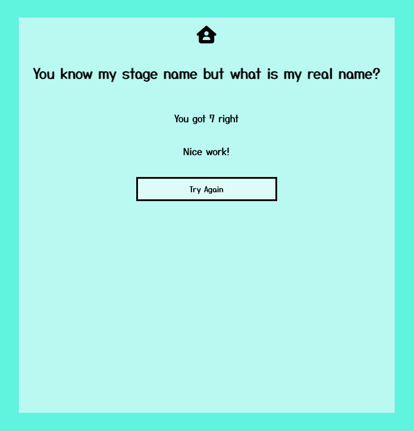

### How these features support the User Stories
- The User Stories in the [User Experience (UX)](#user-experience-ux) part of this document are numbered U01-07. The existing features are listed above F01 to F04. Below is a traceability matrix cross referencing the user stories with the features, illustrating which features support which stories :
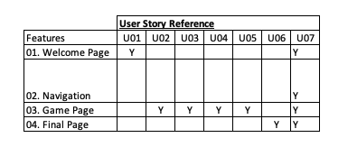

### Features which could be implemented in the future

- Potential future features could be:
- Random selection of questions coded in the background based on a level of difficulty at the users choice.

## **Design**

### Colour Scheme
- The colour scheme across the screens was kept simple and consistent so that it wouldnt be distracting and was inspired by colours used on quiz sites that appear to indicate playfulness and simple in look.

### Typography

- Google Fonts were used to import the Yusei Magic Sans Serif fonts into styles.css. Yusei Magic was chosen as it had a current game feel and is highly readable which helps a game site using words.

### Wireframes
- Desktop Wireframes
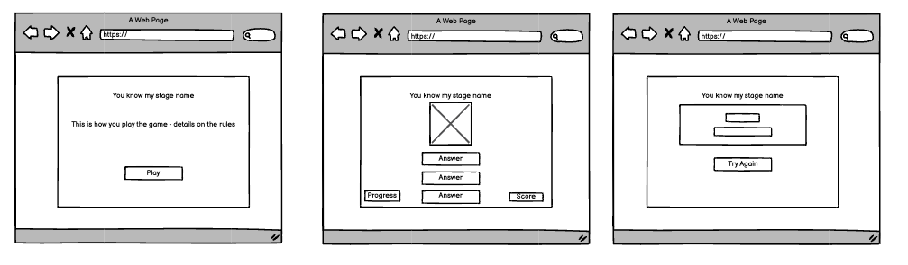

- Tablet Wireframes
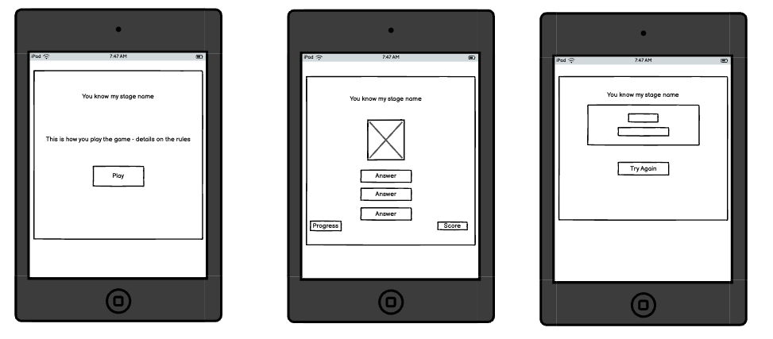

- Smartphone Wireframes
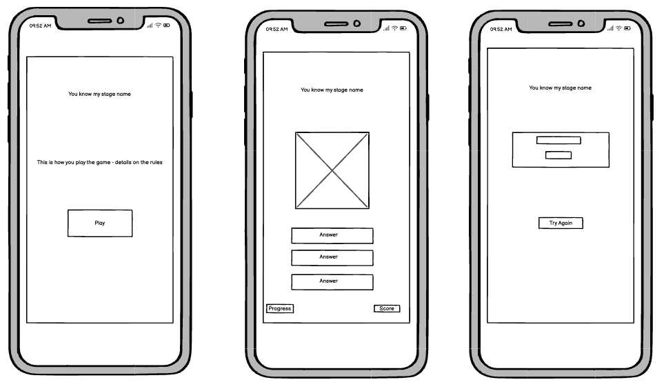

## **Technologies Used**

### Languages Used
- [HTML 5](https://en.wikipedia.org/wiki/HTML5)
- [CSS3](https://en.wikipedia.org/wiki/Cascading_Style_Sheets)
- [Javascript](https://en.wikipedia.org/wiki/JavaScript)

### Frameworks, Libraries & Programs Used

- [Google fonts:](https://fonts.google.com/) was used to import the Yusei Magic font.
- [Font Awesome:](https://fontawesome.com/) was used to add icons for UX Purpose.
- [Git:](https://www.git-scm.com/) was used for version control by utilising the Gitpod terminal to commit to Git and Push to Github.
- [GitHub:](https://github.com/) is used as the repository for the projects code after being pushed to Git.
- [Apple Photos](https://www.apple.com/uk/ios/photos/) was used for resizing images and editing photos for the website.
- [CloudConvert:](http://cloudconvert.com/) was used to edit the format for images and convert for easy loading for the website.
- [Balsamiq:](https://balsamiq.com) was used to create the wireframes during the design process.

## **Testing**

### Validator Testing

- [HTML Validator](https://validator.w3.org)

- result for index.html
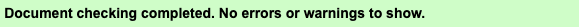

Full Validation results are available on github

- [CSS Validator](https://jigsaw.w3.org/css-validator)

Full Validation results are available on github

- The warnings are due to 1)import of the Google fonts

- [JavaScript Validator](https://jshint.com/)
- result for script.js
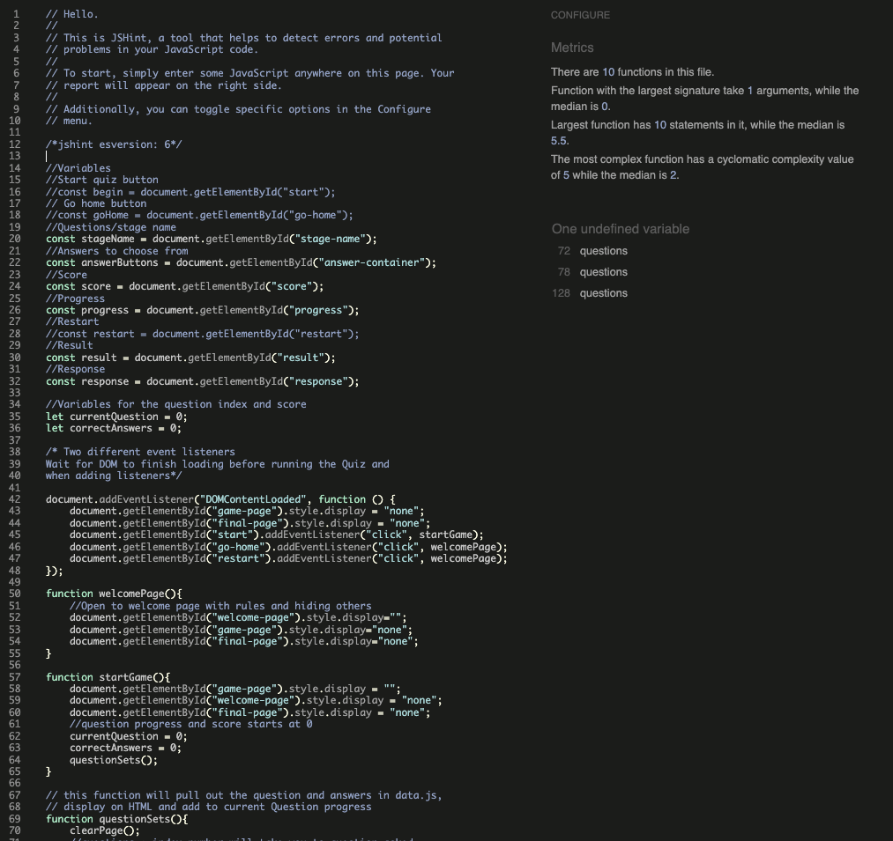

- result for data.js
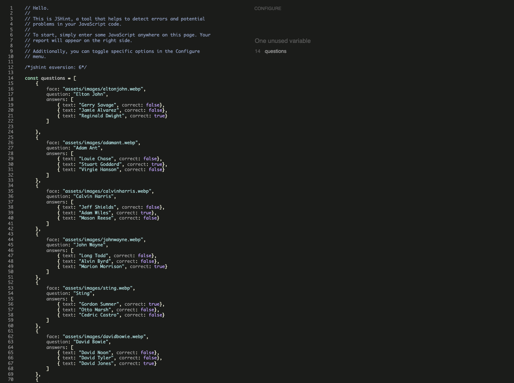

The reason for the unused variable "questions" message is that that data.js file holds the game data in a separate file to the rest of the site code.

## Browser Compatibility

- Testing has been carried out on the following browsers :
- Chrome Version 114.0.5735.198 (Official Build) (arm64)
- Firefox Version 113.0.2 (64-bit)
- Edge Version 114.0.1823.67 (Offical Build) (64-bit)

### Test Cases and Results

- The below table details the test cases that were used, the results and a cross reference to the feature that each test exercised

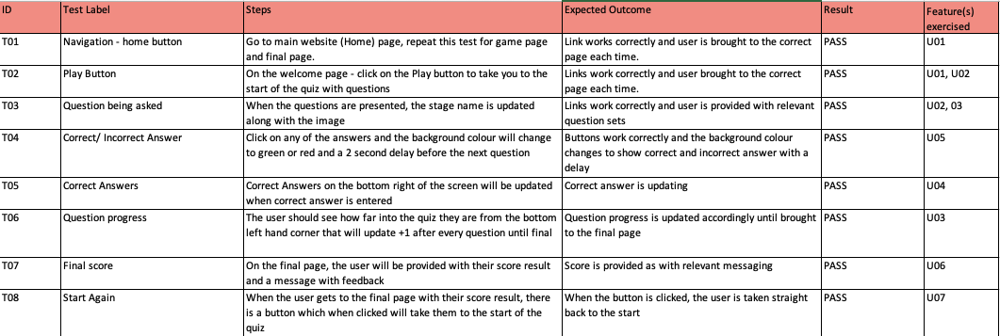

### Known Bugs

- No known bugs

### Accessibility
- I can confirm that the colors and fonts chosen are easy to read and accessible by running it through the lighthouse in dev tools.

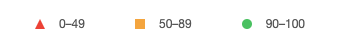

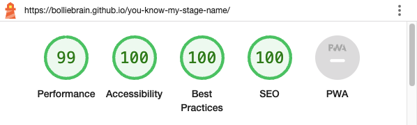

## Deployment

### How this site was deployed

- In the Github respository, navigate to the settings tab, then choose Pages from the left hand meny
- From the source section drop-down menu, select the Master Branch
- Once the master branch has been selected, the page will be automatically refreshed with a detailed ribbon display to indicate the successful deployment

The live link can be found here - [You know my stage name](https://bolliebrain.github.io/you-know-my-stage-name/index.html)

### How to clone the repository

- Go to the https://github.com/bolliebrain/you-know-my-stage-name repository on Github
- Click the "Code" button and navigate to the directory where you want to locate the clone
- On the command line, type "git clone" then paste in the copied url and press the Enter key to begin the clone process
- Changes made to the local clone can be pushed back to the repository using the following commans

- git add *filenames* (or "." to add all changed files)
- git commit -m *"text message describing changes"*
- git push

. N.B. Any changes pushed to the master branch will take effect on the live project

## Credits

### Content
- The questions were sourced mainly from the below website:

- [Elle](https://www.elle.com/culture/celebrities/news/g30012/celebrities-real-names/)

### Media
- The fonts were imported from [Google Fonts](https://fonts.google.com/)
- The Home icon was taken from [Font Awesome](https://fontawesome.com/)
- The favicon was created from [Favicon](https://favicon.io/emoji-favicons/eight-pointed-star/)
- Various images for the questions sets were taken from [Wikimedia](https://commons.wikimedia.org/wiki/Main_Page), also to give credit to (as have received permission on the conditions giving credit):
- [Adamant](https://www.flickr.com/photos/69880995@N04/49890070448/)
- [Calvin Harris](https://flickr.com/photos/14247646@N00/7395505238)
- [Sting](https://flickr.com/photos/69880995@N04/41713255002)

### Code
- The coding within the Question Sets and Check Answer were influenced by the following youtube video [Quiz App] (https://www.youtube.com/watch?v=PBcqGxrr9g8). This includes the game script.
- [W3 Schools](https://www.w3schools.com/) was used to as a point of reference for adding inner HTML, fixing CSS and HTML code.
- Simple layout and score Generator was inspired by Love Maths.
- Delaying a javascript function - [Tutorialspoint](https://www.tutorialspoint.com/How-to-delay-a-JavaScript-function-call-using-JavaScript)

### Acknowledgements

- Thank you to my mentor Elaine Broche for her ongoing help and feedback. For also providing tips on the keeping the code tidy and providing guidance on functions.

